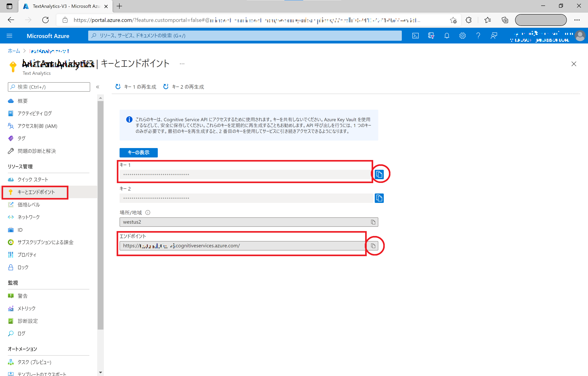

# Microsoft Azure Cognitive Services | Applied AI Services を利用した 自然言語処理アプリ

"人工知能 API" [Microsoft Azure Cognitive Services](https://www.microsoft.com/cognitive-services/) や [Microsoft Azure Applied AI Services](https://azure.microsoft.com/ja-jp/product-categories/applied-ai-services/) を使うと、自然言語処理や分析を行うエンジンをノーコーディングで利用、作成できます。

- [Text Analytics](https://azure.microsoft.com/ja-jp/services/cognitive-services/text-analytics/) は、自然言語処理を行って、文章中のキーワードやエンティティの抽出、センチメント分析、文章要約を行うエンジンをすぐに Web API で利用できます。

# サンプルの動作確認

- [Text Summarization](https://coglangsamples.z11.web.core.windows.net/)


# サンプルの利用方法

- Text Analytics : Summarize ([HTML(JavaScript)](#summarizehtmljavascript))
- Cognitive Services for Language: Language Detection | Sentiment  ([Azure Functions (NodeJS/JavaScript)](#languagedetectionsentimentazurefunctionsnodejsjavascript))

## Cognitive Services の準備

### Text Analytics を使う場合

Azure Portal から Text Analytics の エンドポイント(URL) と キー (Subscription Key) を取得しておきます。
**Key1** に表示されている文字列が キー (Subscription Key) になります。



### Cognitive Services for Language を使う場合

Azure Portal から Cognitive Services for Language の エンドポイント(URL) と キー (Subscription Key) を取得しておきます。
**Key1** に表示されている文字列が キー (Subscription Key) になります。


## Summarize - HTML (JavaScript)

[textanalytics_script.js](samples/JavaScript/Summarize/scripts/textanalytics_script.js)

以下の箇所を取得したエンドポイントおよびキーで書き換えます。

```textanalytics_script.js
// Text Analytics の Subscription Key と URL をセット
// Azure Portal 画面に表示される URL および Key をコピーしてください
var subscriptionKey = "YOUR_API_KEY";
var endpoint = "https://YOUR_SERVICE_URL.cognitiveservices.azure.com/";
```

[TextAnalyticsSummarize.html](samples/JavaScript/Summarize/TextAnalyticsSummarize.html) を開き、文章を入力して動作を確認できます。

## Language Detection | Sentiment - Azure Functions (NodeJS/JavaSscript)

[TextAnalyticsFunc202207](samples/JavaScript/Sentiment/TextAnalyticsFunc202207) フォルダーを Visual Studio Code などで開きます。

[index.js](samples/JavaScript/Sentiment/TextAnalyticsFunc202207/TextAnalyticsFunc/index.js)

以下の箇所を取得したエンドポイントおよびキーで書き換えます。

```index.js
const key = "YOUR_API_KEY";
const endpoint = "https://YOUR_SERVICE_NAME.cognitiveservices.azure.com/"
```

``npm start`` で起動します。


以下の環境で構築、動作確認をしています;

- MacOS 12.5
- NodeJS v16.16.0
- Visual Studio Code v1.69.2
  - [Azure Functions 拡張機能 & Azure Functions Core Tools](https://marketplace.visualstudio.com/items?itemName=ms-azuretools.vscode-azurefunctions)
  - [環境構築方法] (https://docs.microsoft.com/ja-jp/azure/azure-functions/create-first-function-vs-code-node)


