# Microsoft Cognitive Services を利用した テキスト分析ソリューション 開発 (202110 版: Text Analytics)

"人工知能 API" [Microsoft Azure Cognitive Services](https://www.microsoft.com/cognitive-services/) や [Microsoft Azure Applied AI Services](https://azure.microsoft.com/ja-jp/product-categories/applied-ai-services/) を使うと、画像分析を行うエンジンをノーコーディングで利用、作成できます。

[Text Analytics](https://azure.microsoft.com/ja-jp/services/cognitive-services/text-analytics/) は、文章からキーフレーズの抽出やセンチメント(感情、ネガポジ)分析を行うエンジンをすぐに Web API で利用できるサービスです。

ここでは、Text Analytics を 利用して、Twitter ツイートやアンケートなどで収集した VOC (Voice of Customer: 顧客の声) データからのキーフレーズ抽出やセンチメント判定を自動化する方法を紹介します。


## 目次

0. [準備](#準備)
1. [Text Analytics の機能を確認](#1-text-analytics-の機能を確認)
    - 1.1 キーフレーズ抽出
    - 1.2 センチメント判定
    - 1.3 抽出要約
2. Text Analytics を利用した VOC データ分析
    - [Power Platform × M365 編] Power Automate & OneDrive for Business, Excel を用いて自動化する


## 準備

- Azure サブスクリプション & Text Analytics のサービス申込
  - Azure サブスクリプション の申し込みには マイクロソフトアカウントが必要です。
  - [Azure 無償サブスクリプション準備](https://qiita.com/annie/items/3c9ddc3fb8f120769239) の手順で、Azure サブスクリプション申込を行います(無償以外の有償アカウント等でも問題ありません)。
  - [Cognitive Services サブスクリプション準備](https://github.com/ayako/AzureDXHol_AI_202001/blob/master/CogServicesHol_Subscription_202107.md) の手順で、Text Analytics のサービス作成を行います。
    - Text Analytics のエンドポイント(Rest API アクセス URL)と、アクセスキー をローカルに保存しておきます。

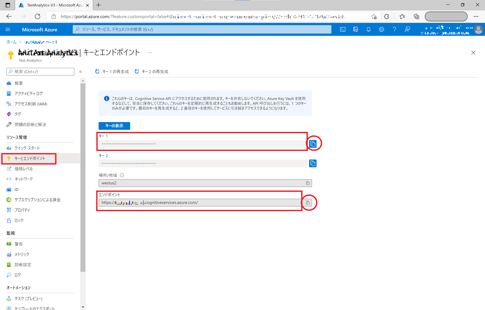


- [Power Platform × M365 編] Power Platform (Power Automate) & Microsoft 365 のサービス申し込み
  - Power Automate および Microsoft 365 (OneDrive および Excel) が利用できるアカウントを準備しておきます。


- 分析したい VOC データ
  - VOC データを CSV ファイルで用意します。全てのデータに **id** (データ内で一意となるように設定してください), **text** (分析したい文章), **language** (ISO言語コード(2文字)、日本語なら "ja") の項目が必要です。(他の項目が入っていても構いません)

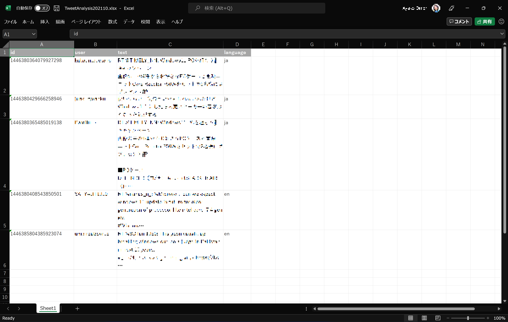


## 手順

### 1. Text Analytics の機能を確認

#### 1.1 Text Analytics によるキーフレーズ抽出

Text Analytics の [API リファレンス(Text Analytics - Key Phrases)](https://westus2.dev.cognitive.microsoft.com/docs/services/TextAnalytics-v3-2-Preview-1/operations/KeyPhrases) を開きます。

API リファレンスのページの中頃にリージョンごとの API コンソールへのリンクが表示されます。Text Analytics を作成したリージョン (ここでは Japan East) をクリックします。

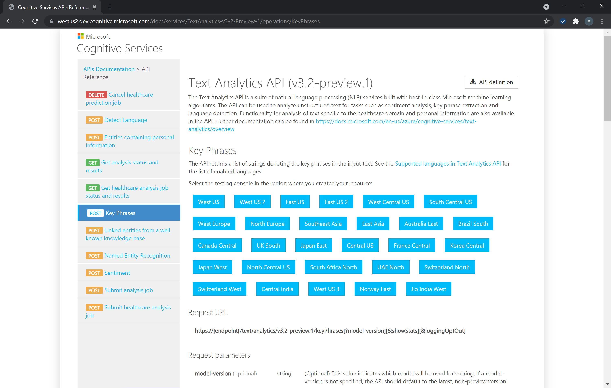

**Text Analytics - Key Phrases** API コンソール のページ中頃に HTTP Request 設定箇所がありますので、必要事項を入力します。

- Query parameters
  - **× Remove parameter** をクリックして、すべてのパラメーターの欄を削除します
- Headers
  - **Content-Type** : application/json(デフォルト値)
  - **Ocp-Apim-Subscription-Key** : ローカルに保存しておいた Text Analytics の API Key

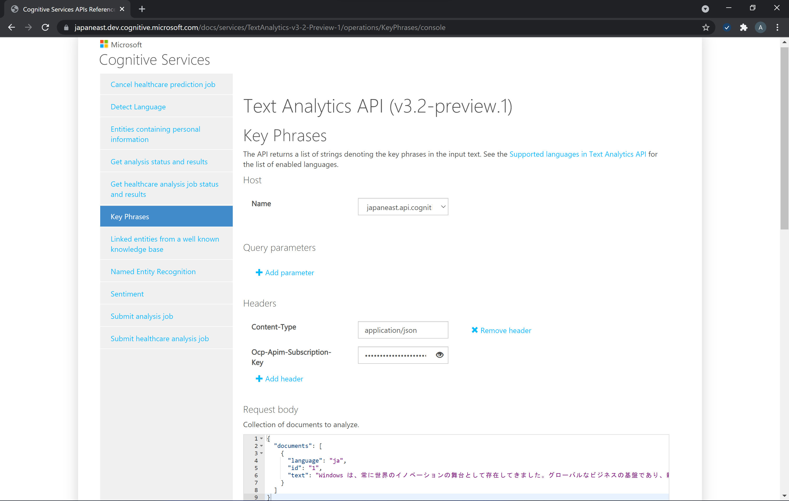

**Request body** には、キーフレーズ抽出を行いたいテキストおよび 言語, id を指定します。今回は、例えば以下のような JSON フォーマットで設定します。

```
{
  "documents": [
    {
      "id": "1",
      "language": "ja",
      "text": "Windows は、常に世界のイノベーションの舞台として存在してきました。グローバルなビジネスの基盤であり、新進気鋭のスタートアップ企業が誰もが知る存在になった場所でもあります。ウェブが生まれると、それは Windows の上で成長してきました。私たちの多くが、初めてメールを書いたのも、初めて PC ゲームをプレイしたのも、初めてプログラムのコードを書いたのも Windows です。Windows は、人々が創造し、つながり、学習し、達成するための場所であり、現時点で 10 億以上もの人々が利用しているプラットフォームです。"
    }
  ]
}
```

**[Send]** をクリックすると、Web Request が送信されます。

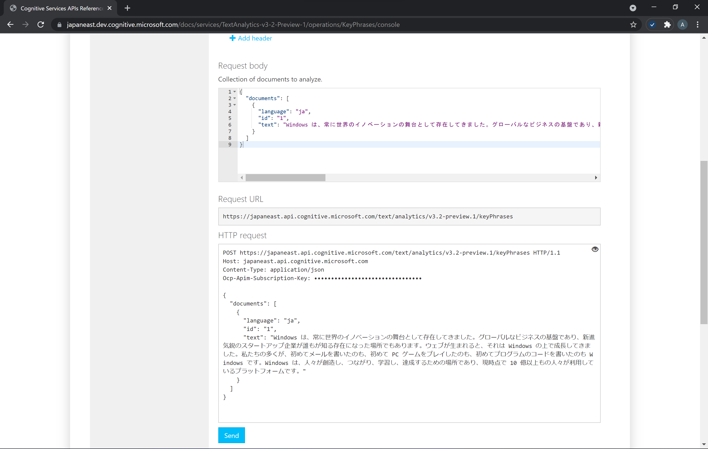

**Response Status** が 200、Response Content に判定結果が表示されるのを確認してください。投入したテキストから抽出されたキーフレーズが　**KeyPhrases** の値として表示されます。

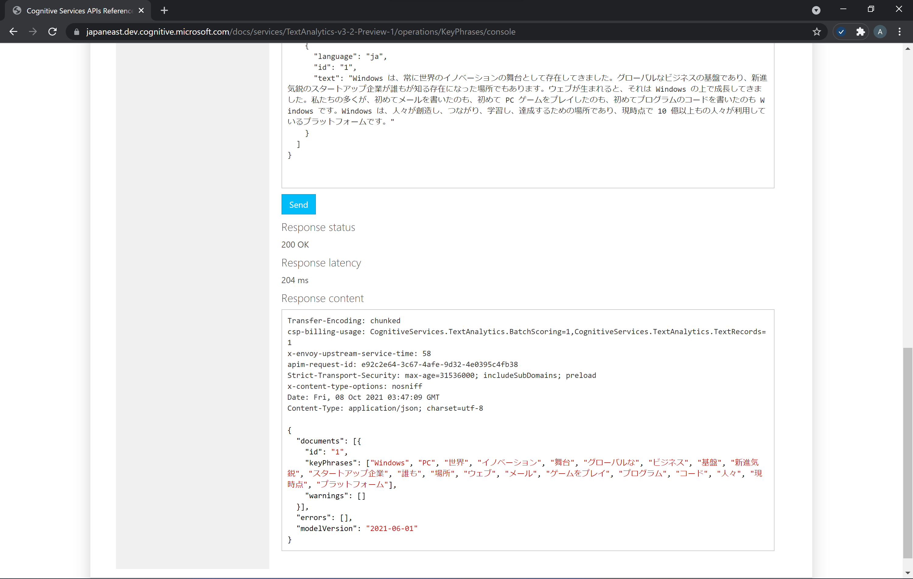


#### 1.2 Text Analytics によるセンチメント判定

次にセンチメント判定を行います。Text Analytics の [API リファレンス(Text Analytics - Sentiment)](https://westus2.dev.cognitive.microsoft.com/docs/services/TextAnalytics-v3-2-Preview-1/operations/Sentiment) を開きます。

API リファレンスのページの中頃にリージョンごとの API コンソールへのリンクが表示されます。Text Analytics を作成したリージョン (ここでは Japan East) をクリックします。

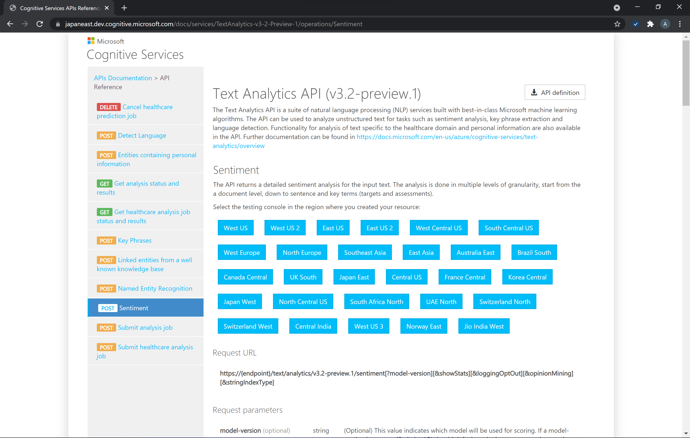

**Text Analytics - Key Phrases** API コンソール のページ中頃に HTTP Request 設定箇所がありますので、必要事項を入力します。

- Query parameters
  - **× Remove parameter** をクリックして、すべてのパラメーターの欄を削除します
- Headers
  - **Content-Type** : application/json(デフォルト値)
  - **Ocp-Apim-Subscription-Key** : ローカルに保存しておいた Text Analytics の API Key

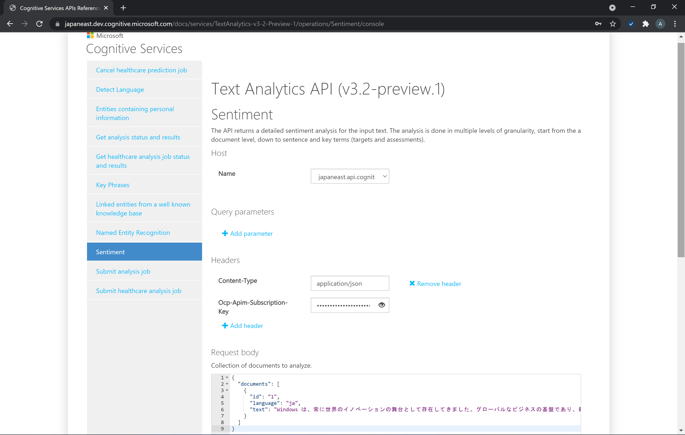

**Request body** には、センチメント判定したいテキストおよび 言語, id を指定します。今回は、例えば以下のような JSON フォーマットで設定します。

```
{
  "documents": [
    {
      "id": "1",
      "language": "ja",
      "text": "Windows は、常に世界のイノベーションの舞台として存在してきました。グローバルなビジネスの基盤であり、新進気鋭のスタートアップ企業が誰もが知る存在になった場所でもあります。ウェブが生まれると、それは Windows の上で成長してきました。私たちの多くが、初めてメールを書いたのも、初めて PC ゲームをプレイしたのも、初めてプログラムのコードを書いたのも Windows です。Windows は、人々が創造し、つながり、学習し、達成するための場所であり、現時点で 10 億以上もの人々が利用しているプラットフォームです。"
    }
  ]
}
```

**[Send]** をクリックすると、Web Request が送信されます。

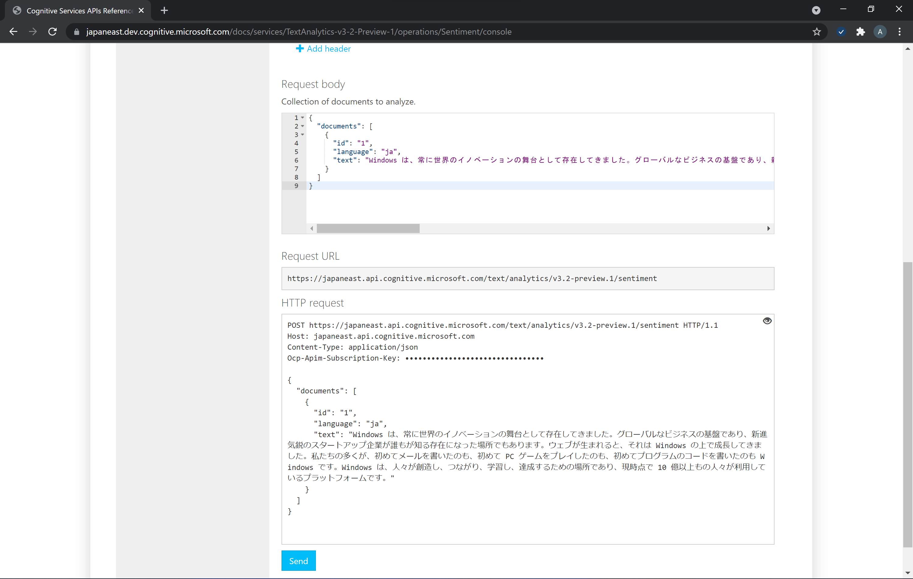

**Response Status** が 200、Response Content に判定結果が表示されるのを確認してください。投入したテキスト全体、および一文ごとにセンチメント判定が行われて、それぞれ Positive | Neutral | Negative のいずれか、および確度がスコア値として表示されているのを確認してください。

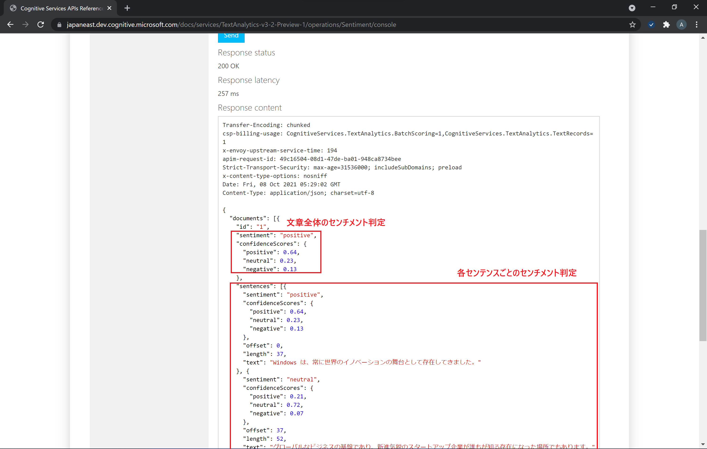


#### 1.3 Text Analytics による抽出要約

今度は抽出要約を行います。Text Analytics の [API リファレンス(Text Analytics - Submit analysis job)](https://westus2.dev.cognitive.microsoft.com/docs/services/TextAnalytics-v3-2-Preview-1/operations/Analyze) を開きます。

API リファレンスのページの中頃にリージョンごとの API コンソールへのリンクが表示されます。Text Analytics を作成したリージョン (ここでは Japan East) をクリックします。

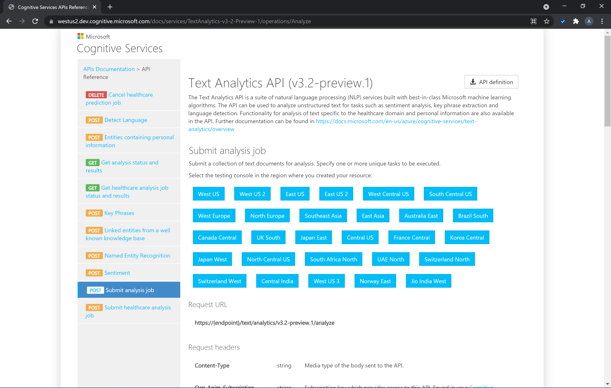

**Text Analytics - Key Phrases** API コンソール のページ中頃に HTTP Request 設定箇所がありますので、必要事項を入力します。

- Query parameters
  - **× Remove parameter** をクリックして、すべてのパラメーターの欄を削除します
- Headers
  - **Content-Type** : application/json(デフォルト値)
  - **Ocp-Apim-Subscription-Key** : ローカルに保存しておいた Text Analytics の API Key

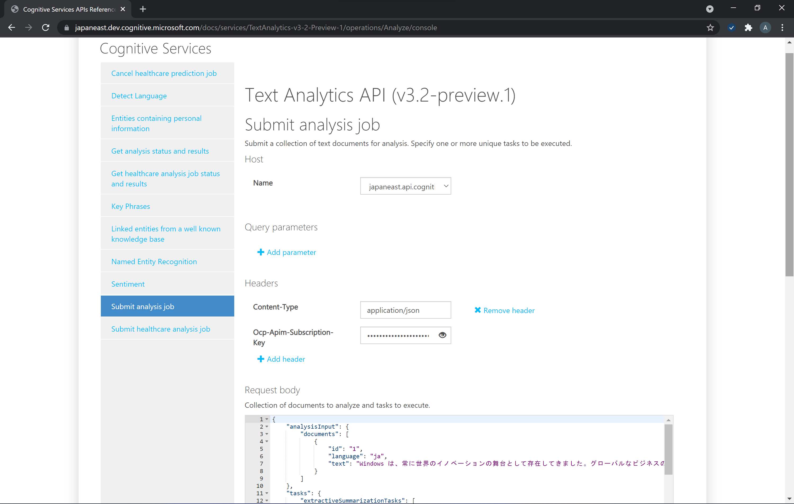

**Request body** には、抽出要約を行いたいテキストおよび 言語, id を指定し、**extractiveSummarizationTasks** の項目を設定します。今回は、例えば以下のような JSON フォーマットで設定します。

```
{
	"analysisInput": {
		"documents": [
			{
                "id": "1",
                "language": "ja",
                "text": "Windows は、常に世界のイノベーションの舞台として存在してきました。グローバルなビジネスの基盤であり、新進気鋭のスタートアップ企業が誰もが知る存在になった場所でもあります。ウェブが生まれると、それは Windows の上で成長してきました。私たちの多くが、初めてメールを書いたのも、初めて PC ゲームをプレイしたのも、初めてプログラムのコードを書いたのも Windows です。Windows は、人々が創造し、つながり、学習し、達成するための場所であり、現時点で 10 億以上もの人々が利用しているプラットフォームです。"
			}
		]
	},
	"tasks": {
		"extractiveSummarizationTasks": [
			{
				"parameters": {
				    "model-version": "latest",
				    "sentenceCount": 3,
				    "sortBy": "Offset"					
				}
			}
		]
	}
}
```

**[Send]** をクリックすると、Web Request が送信されます。

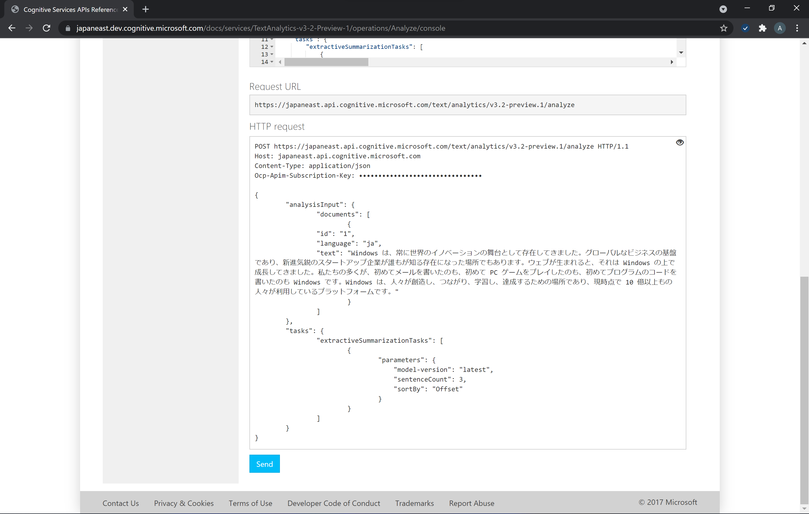

**Response Status** に **202 Accepted** と表示されるのを確認してください。**Response content** に分析ジョブを投入した結果が表示され、**operaion-location** の値にジョブのステータスおよび結果を取得する Job Id (が含まれたURL) が提示されます。Job Id をコピーしてローカルに保存しておきます。

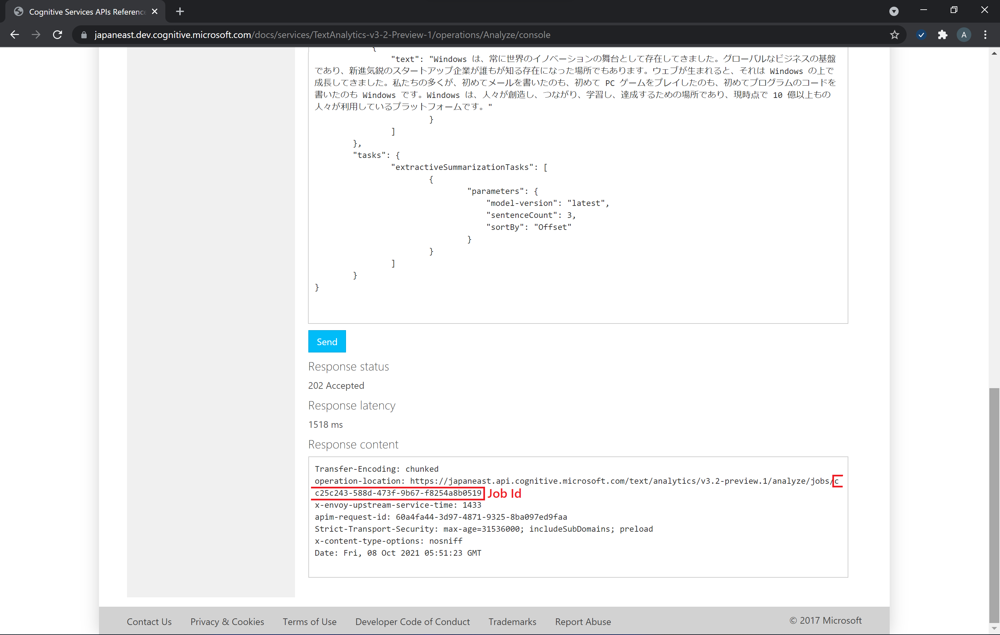


抽出要約を行うジョブのステータスおよび結果を取得します。Text Analytics の [API リファレンス(Text Analytics - Get analysis status and results)](https://westus2.dev.cognitive.microsoft.com/docs/services/TextAnalytics-v3-2-Preview-1/operations/AnalyzeStatus) を開きます。Text Analytics を作成したリージョン (ここでは Japan East) をクリックして API コンソール画面を表示します。

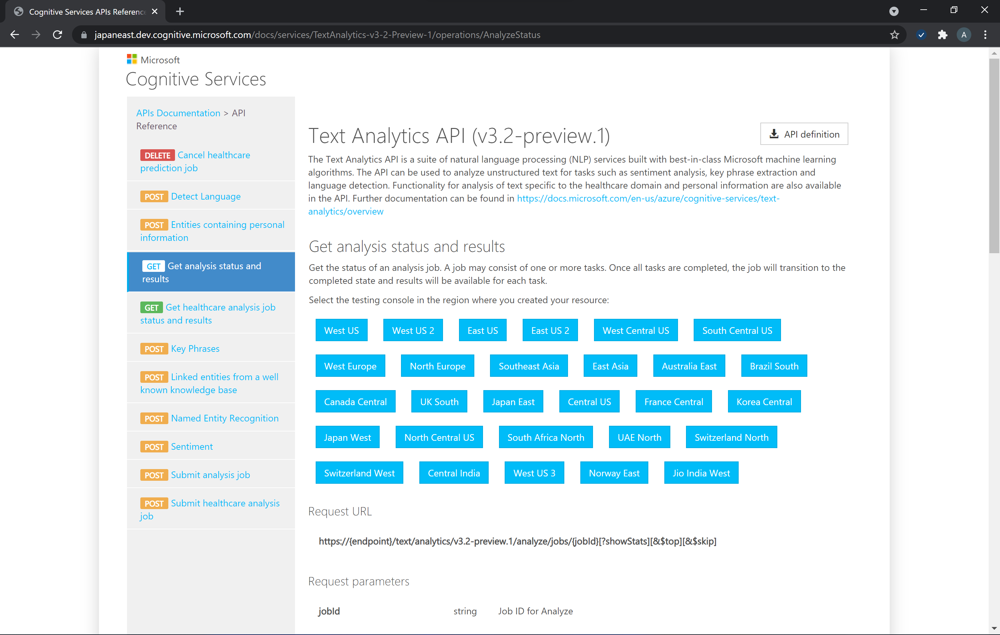

- Query parameters
  - **JobId**: ローカルに保存しておいた Job Id
- Headers
  - **Ocp-Apim-Subscription-Key** : ローカルに保存しておいた Text Analytics の API Key

**[Send]** をクリックすると、Web Request が送信されます。

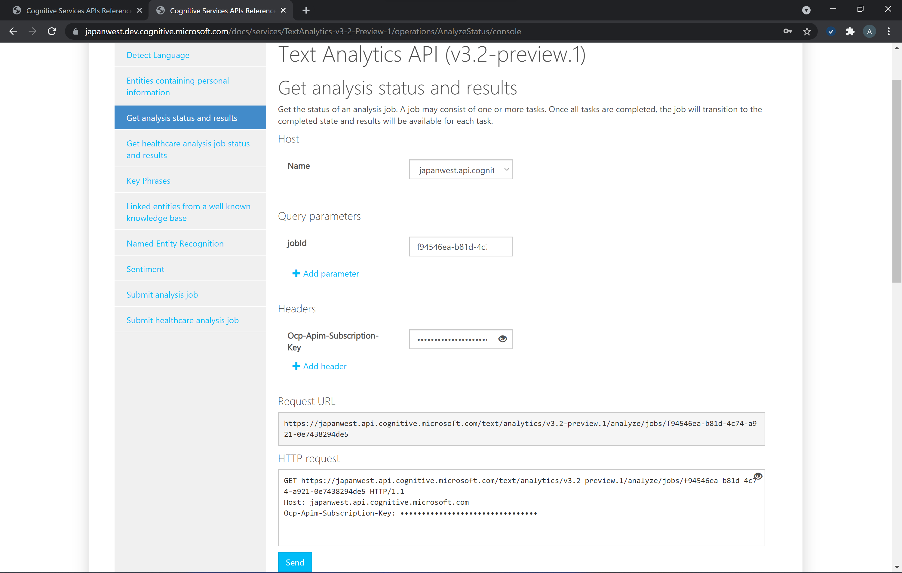

**Response Status** が 200、Response Content に判定結果が表示されるのを確認してください。投入した文章が sentenceCount のパラメータで指定した 3 (文) で抽出要約されているのを確認してください。


### 2. Text Analytics を利用した VOC データ分析

#### [Power Platform × M365 編] Power Automate & OneDrive for Business, Excel を用いて自動化する

##### データの準備

VOC データ (CSV ファイル) を Excel で開きます。
各行のデータに **id**, **text**, **language** の項目が入力されていることを確認します。
データの見出し、および全データを選択して、ツールバー > 挿入 > テーブル をクリック、選択範囲をテーブルに変換します。

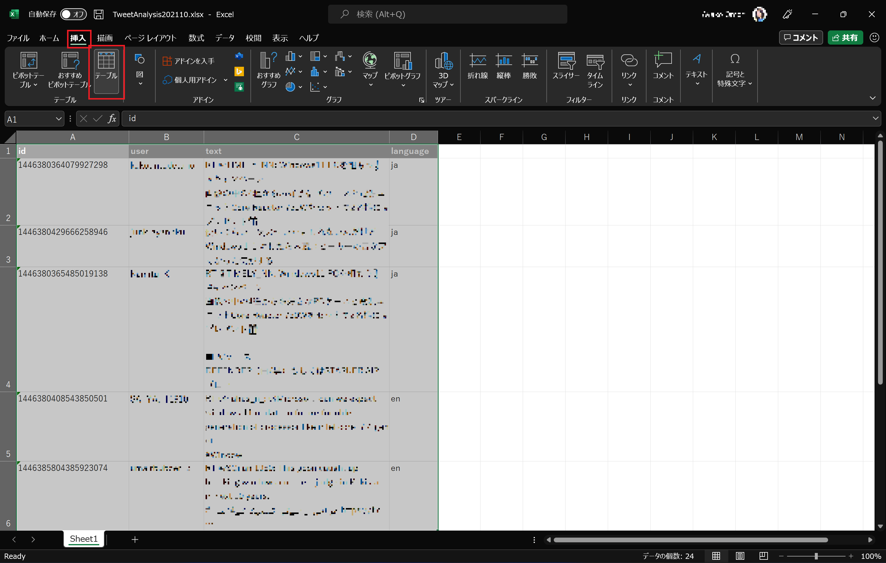

**テーブルの作成ペイン** で **先頭行をテーブルの見出しとして** にチェックを付けて **[OK]** をクリックします。

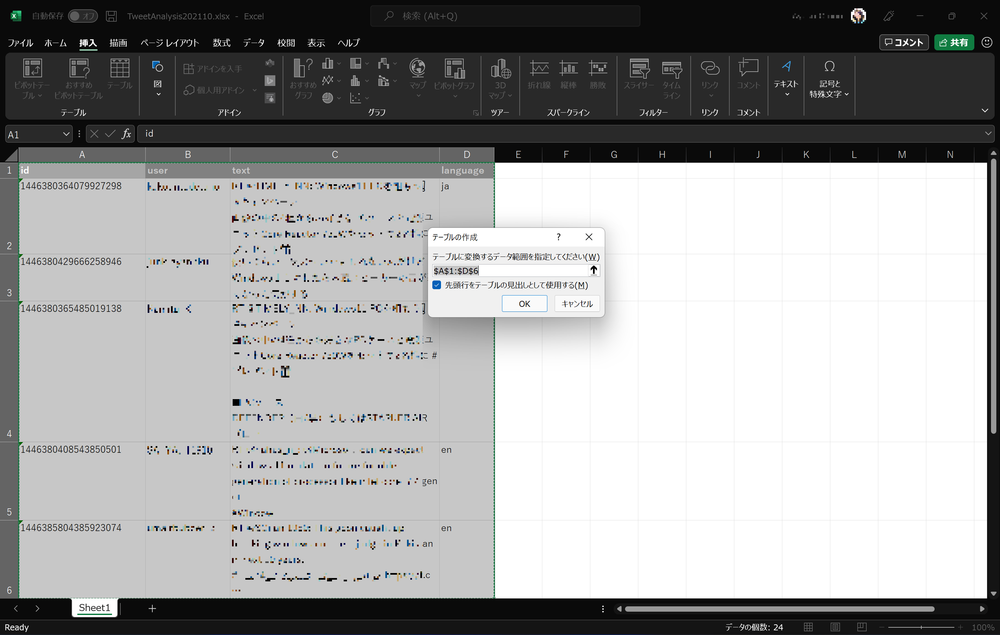

テーブルに変換後、ツールバー > テーブルデザイン をクリックして、プロパティの欄で名前を **VOC_Table** に変更しておきます。
VOC データを Excel 形式 (*.xlsx) として保存します。

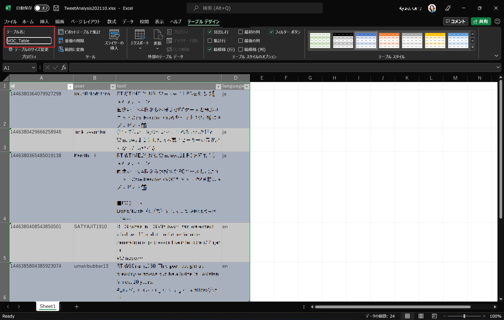

OneDrive for Business (M365) 配下に新規フォルダーを作成し (または既に作成済みのフォルダーを利用しても OK)、テーブル変換を行った VOC データ(Excel ファイル) をアップロードしておきます。

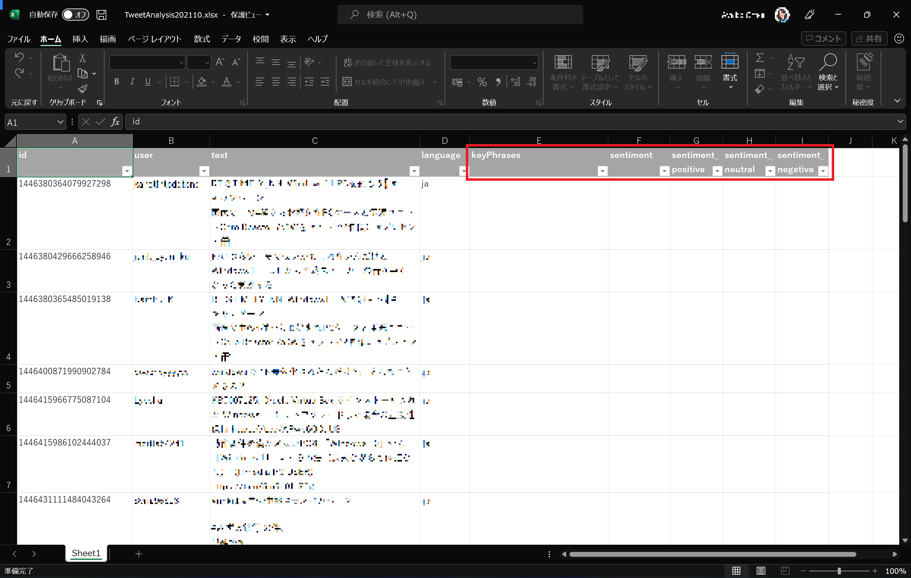
