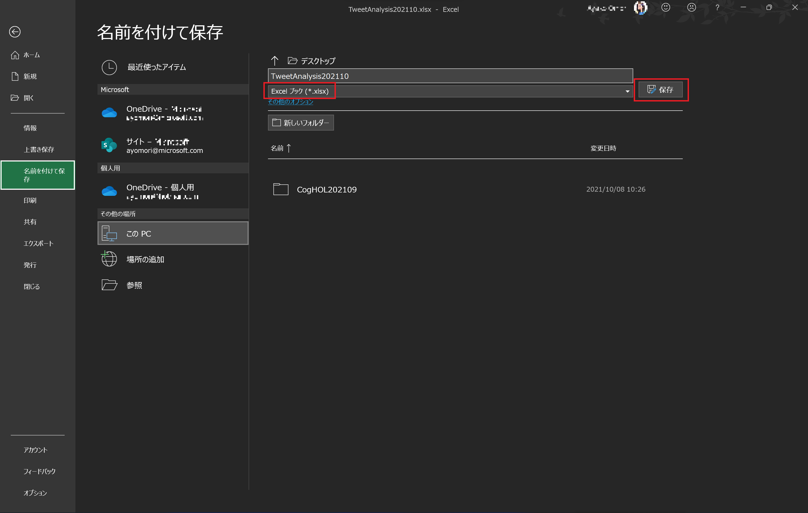
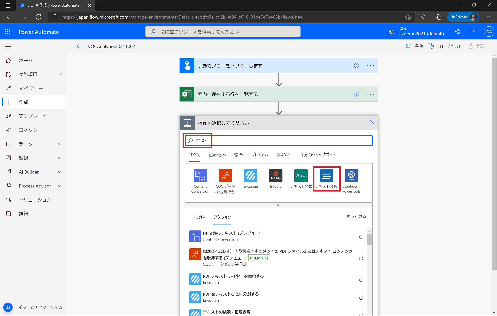
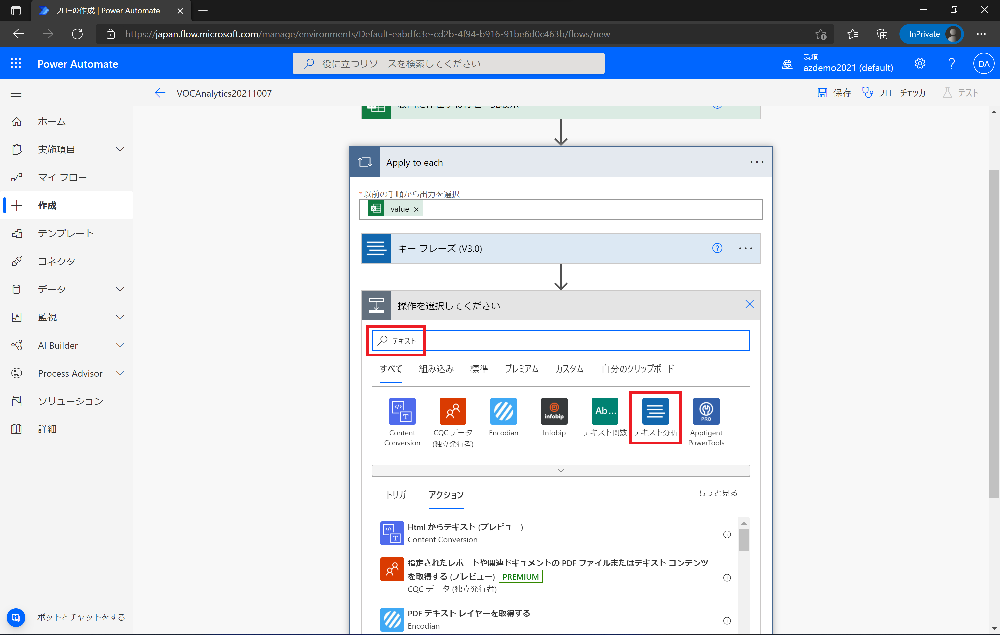
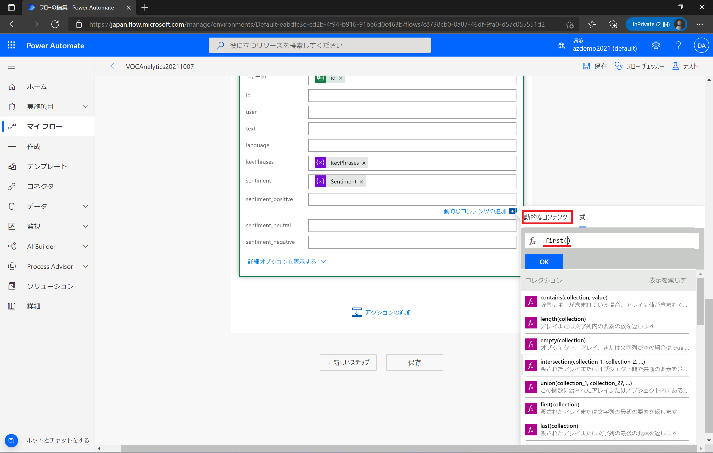
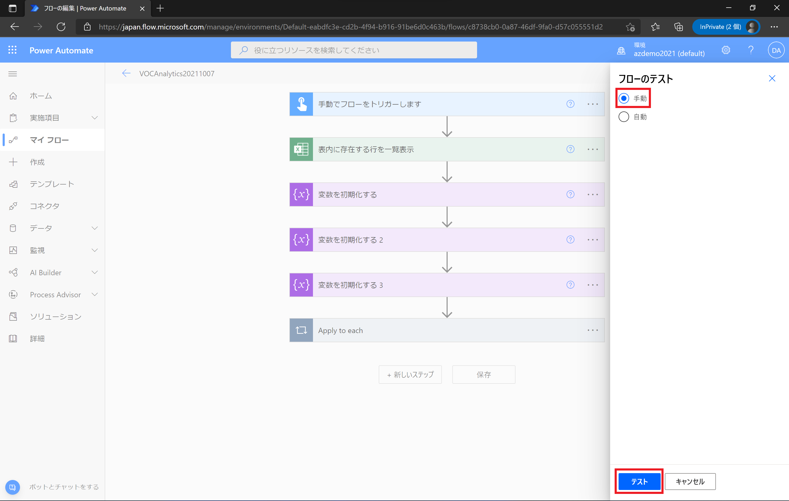
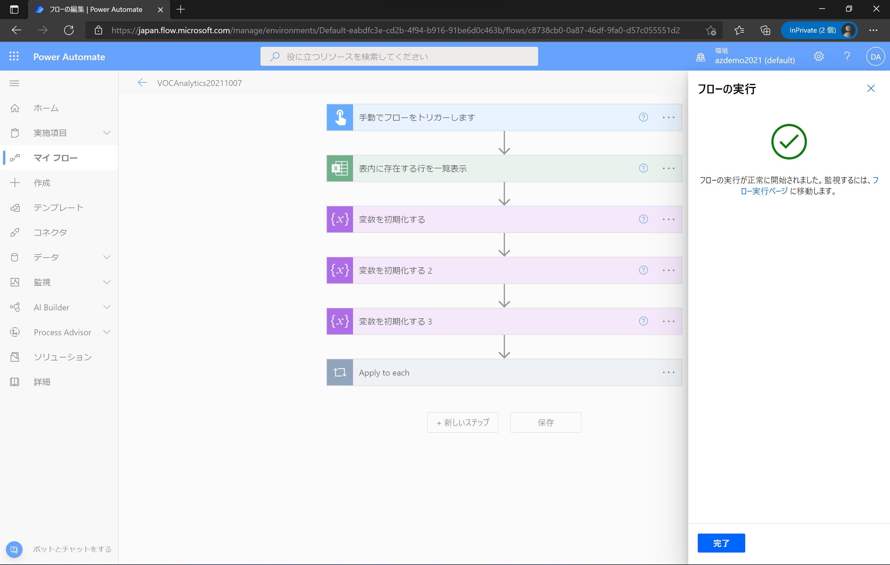
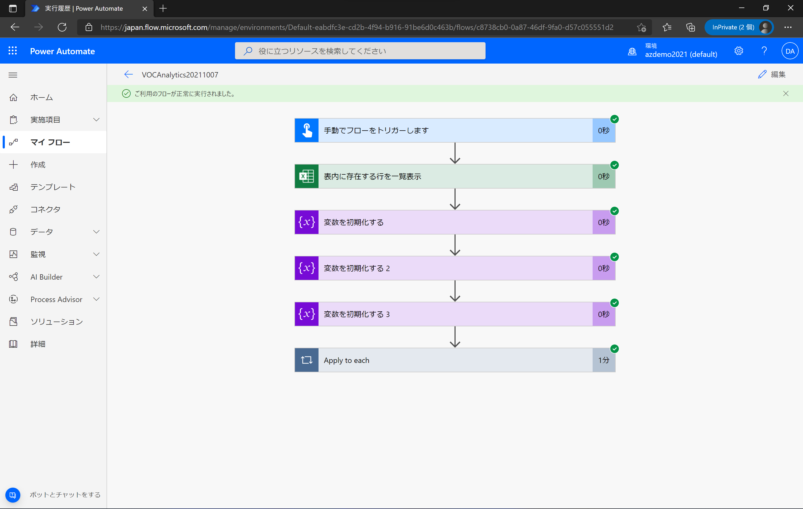

# Microsoft Cognitive Services を利用した テキスト分析ソリューション 開発 (202110 版: Text Analytics)

"人工知能 API" [Microsoft Azure Cognitive Services](https://www.microsoft.com/cognitive-services/) や [Microsoft Azure Applied AI Services](https://azure.microsoft.com/ja-jp/product-categories/applied-ai-services/) を使うと、画像分析を行うエンジンをノーコーディングで利用、作成できます。

[Text Analytics](https://azure.microsoft.com/ja-jp/services/cognitive-services/text-analytics/) は、文章からキーフレーズの抽出やセンチメント(感情、ネガポジ)分析を行うエンジンをすぐに Web API で利用できるサービスです。

ここでは、Text Analytics を 利用して、Twitter ツイートやアンケートなどで収集した VOC (Voice of Customer: 顧客の声) データからのキーフレーズ抽出やセンチメント判定を自動化する方法を紹介します。


## 目次

0. [準備](#準備)
1. [Text Analytics の機能を確認](#1-text-analytics-の機能を確認)
    - 1.1 キーフレーズ抽出
    - 1.2 センチメント判定
    - 1.3 抽出要約
2. Text Analytics を利用した VOC データ分析
    - [Power Platform × M365 編] Power Automate & OneDrive for Business, Excel を用いて自動化する


## 準備

- Azure サブスクリプション & Text Analytics のサービス申込
  - Azure サブスクリプション の申し込みには マイクロソフトアカウントが必要です。
  - [Azure 無償サブスクリプション準備](https://qiita.com/annie/items/3c9ddc3fb8f120769239) の手順で、Azure サブスクリプション申込を行います(無償以外の有償アカウント等でも問題ありません)。
  - [Cognitive Services サブスクリプション準備](https://github.com/ayako/AzureDXHol_AI_202001/blob/master/CogServicesHol_Subscription_202107.md) の手順で、Text Analytics のサービス作成を行います。
    - Text Analytics のエンドポイント(Rest API アクセス URL)と、アクセスキー をローカルに保存しておきます。


- [Power Platform × M365 編] Power Platform (Power Automate) & Microsoft 365 のサービス申し込み
  - Power Automate および Microsoft 365 (OneDrive および Excel) が利用できるアカウントを準備しておきます。


- 分析したい VOC データ
  - VOC データを CSV ファイルで用意します。全てのデータに **id** (データ内で一意となるように設定してください), **text** (分析したい文章), **language** (ISO言語コード(2文字)、日本語なら "ja") の項目が必要です。(他の項目が入っていても構いません)


## 手順

### 1. Text Analytics の機能を確認

#### 1.1 Text Analytics によるキーフレーズ抽出

Text Analytics の [API リファレンス(Text Analytics - Key Phrases)](https://westus2.dev.cognitive.microsoft.com/docs/services/TextAnalytics-v3-2-Preview-1/operations/KeyPhrases) を開きます。

API リファレンスのページの中頃にリージョンごとの API コンソールへのリンクが表示されます。Text Analytics を作成したリージョン (ここでは Japan East) をクリックします。


**Text Analytics - Key Phrases** API コンソール のページ中頃に HTTP Request 設定箇所がありますので、必要事項を入力します。

- Query parameters
  - **× Remove parameter** をクリックして、すべてのパラメーターの欄を削除します
- Headers
  - **Content-Type** : application/json(デフォルト値)
  - **Ocp-Apim-Subscription-Key** : ローカルに保存しておいた Text Analytics の API Key


**Request body** には、キーフレーズ抽出を行いたいテキストおよび 言語, id を指定します。今回は、例えば以下のような JSON フォーマットで設定します。

```
{
  "documents": [
    {
      "id": "1",
      "language": "ja",
      "text": "Windows は、常に世界のイノベーションの舞台として存在してきました。グローバルなビジネスの基盤であり、新進気鋭のスタートアップ企業が誰もが知る存在になった場所でもあります。ウェブが生まれると、それは Windows の上で成長してきました。私たちの多くが、初めてメールを書いたのも、初めて PC ゲームをプレイしたのも、初めてプログラムのコードを書いたのも Windows です。Windows は、人々が創造し、つながり、学習し、達成するための場所であり、現時点で 10 億以上もの人々が利用しているプラットフォームです。"
    }
  ]
}
```

**[Send]** をクリックすると、Web Request が送信されます。


**Response Status** が 200、Response Content に判定結果が表示されるのを確認してください。投入したテキストから抽出されたキーフレーズが　**KeyPhrases** の値として表示されます。


#### 1.2 Text Analytics によるセンチメント判定

次にセンチメント判定を行います。Text Analytics の [API リファレンス(Text Analytics - Sentiment)](https://westus2.dev.cognitive.microsoft.com/docs/services/TextAnalytics-v3-2-Preview-1/operations/Sentiment) を開きます。

API リファレンスのページの中頃にリージョンごとの API コンソールへのリンクが表示されます。Text Analytics を作成したリージョン (ここでは Japan East) をクリックします。


**Text Analytics - Key Phrases** API コンソール のページ中頃に HTTP Request 設定箇所がありますので、必要事項を入力します。

- Query parameters
  - **× Remove parameter** をクリックして、すべてのパラメーターの欄を削除します
- Headers
  - **Content-Type** : application/json(デフォルト値)
  - **Ocp-Apim-Subscription-Key** : ローカルに保存しておいた Text Analytics の API Key


**Request body** には、センチメント判定したいテキストおよび 言語, id を指定します。今回は、例えば以下のような JSON フォーマットで設定します。

```
{
  "documents": [
    {
      "id": "1",
      "language": "ja",
      "text": "Windows は、常に世界のイノベーションの舞台として存在してきました。グローバルなビジネスの基盤であり、新進気鋭のスタートアップ企業が誰もが知る存在になった場所でもあります。ウェブが生まれると、それは Windows の上で成長してきました。私たちの多くが、初めてメールを書いたのも、初めて PC ゲームをプレイしたのも、初めてプログラムのコードを書いたのも Windows です。Windows は、人々が創造し、つながり、学習し、達成するための場所であり、現時点で 10 億以上もの人々が利用しているプラットフォームです。"
    }
  ]
}
```

**[Send]** をクリックすると、Web Request が送信されます。


**Response Status** が 200、Response Content に判定結果が表示されるのを確認してください。投入したテキスト全体、および一文ごとにセンチメント判定が行われて、それぞれ Positive | Neutral | Negative のいずれか、および確度がスコア値として表示されているのを確認してください。


#### 1.3 Text Analytics による抽出要約

今度は抽出要約を行います。Text Analytics の [API リファレンス(Text Analytics - Submit analysis job)](https://westus2.dev.cognitive.microsoft.com/docs/services/TextAnalytics-v3-2-Preview-1/operations/Analyze) を開きます。

API リファレンスのページの中頃にリージョンごとの API コンソールへのリンクが表示されます。Text Analytics を作成したリージョン (ここでは Japan East) をクリックします。


**Text Analytics - Key Phrases** API コンソール のページ中頃に HTTP Request 設定箇所がありますので、必要事項を入力します。

- Query parameters
  - **× Remove parameter** をクリックして、すべてのパラメーターの欄を削除します
- Headers
  - **Content-Type** : application/json(デフォルト値)
  - **Ocp-Apim-Subscription-Key** : ローカルに保存しておいた Text Analytics の API Key


**Request body** には、抽出要約を行いたいテキストおよび 言語, id を指定し、**extractiveSummarizationTasks** の項目を設定します。今回は、例えば以下のような JSON フォーマットで設定します。

```
{
	"analysisInput": {
		"documents": [
			{
                "id": "1",
                "language": "ja",
                "text": "Windows は、常に世界のイノベーションの舞台として存在してきました。グローバルなビジネスの基盤であり、新進気鋭のスタートアップ企業が誰もが知る存在になった場所でもあります。ウェブが生まれると、それは Windows の上で成長してきました。私たちの多くが、初めてメールを書いたのも、初めて PC ゲームをプレイしたのも、初めてプログラムのコードを書いたのも Windows です。Windows は、人々が創造し、つながり、学習し、達成するための場所であり、現時点で 10 億以上もの人々が利用しているプラットフォームです。"
			}
		]
	},
	"tasks": {
		"extractiveSummarizationTasks": [
			{
				"parameters": {
				    "model-version": "latest",
				    "sentenceCount": 3,
				    "sortBy": "Offset"					
				}
			}
		]
	}
}
```

**[Send]** をクリックすると、Web Request が送信されます。


**Response Status** に **202 Accepted** と表示されるのを確認してください。**Response content** に分析ジョブを投入した結果が表示され、**operaion-location** の値にジョブのステータスおよび結果を取得する Job Id (が含まれたURL) が提示されます。Job Id をコピーしてローカルに保存しておきます。


抽出要約を行うジョブのステータスおよび結果を取得します。Text Analytics の [API リファレンス(Text Analytics - Get analysis status and results)](https://westus2.dev.cognitive.microsoft.com/docs/services/TextAnalytics-v3-2-Preview-1/operations/AnalyzeStatus) を開きます。Text Analytics を作成したリージョン (ここでは Japan East) をクリックして API コンソール画面を表示します。


- Query parameters
  - **JobId**: ローカルに保存しておいた Job Id
- Headers
  - **Ocp-Apim-Subscription-Key** : ローカルに保存しておいた Text Analytics の API Key

**[Send]** をクリックすると、Web Request が送信されます。


**Response Status** が 200、Response Content に判定結果が表示されるのを確認してください。投入した文章が sentenceCount のパラメータで指定した 3 (文) で抽出要約されているのを確認してください。


### 2. Text Analytics を利用した VOC データ分析

### [Power Platform × M365 編] Power Automate & OneDrive for Business, Excel を用いて自動化する

#### データの準備

VOC データ (CSV ファイル) を Excel で開きます。
各行のデータに **id**, **text**, **language** の項目が入力されていることを確認します。
データの見出し、および全データを選択して、ツールバー > 挿入 > テーブル をクリック、選択範囲をテーブルに変換します。


**テーブルの作成ペイン** で **先頭行をテーブルの見出しとして** にチェックを付けて **[OK]** をクリックします。


テーブルに変換後、ツールバー > テーブルデザイン をクリックして、プロパティの欄で名前を **VOC_Table** に変更しておきます。


分析結果を保存する列を用意します。**KeyPhrases** (キーフレーズ)、**Sentiment** (センチメント判定)、**Sentiment_Positive**、**Sentiment_Neutral**、**Sentiment_Negative** (センチメントの確度(数値)) という名前で列を追加しておきます。


VOC データを Excel 形式 (*.xlsx) として保存します。



OneDrive for Business (M365) 配下に新規フォルダーを作成し (または既に作成済みのフォルダーを利用しても OK)、テーブル変換を行った VOC データ(Excel ファイル) をアップロードしておきます。


#### Power Automate フローの作成

[Power Automate の トップページ](https://japan.flow.microsoft.com/ja-jp/) を開きます。
左メニューバーから **＋作成** をクリックして、フローの新規作成を行います。


今回は **インスタントクラウドフロー** をクリック、テンプレートを使用しないで作成します。


*インスタントクラウドフローを作成する* ペインで [スキップ] をクリックして進みます。


フロー作成画面上部の **無題** と書かれている欄をクリックし、フローの名前(ご自分で識別しやすいもの)をつけます。(ここでは **VOCAnalysis202110** と入力しています)
トリガーの種類から **モバイルの Flow ボタン** をクリックします。


*トリガー* から **手動でフローをトリガーをします** をクリックします。


**[＋新しいステップ]** をクリックしてフローのステップを追加します。


*コネクター* から **Excel Online (Business)** を選択します。


*アクション* から **表内に存在する行を一覧表示** を選択します。


*表内に存在する行を一覧表示* アクションで OneDrive にアップロードした VOC データ(Excel ファイル) を設定します。
*場所* と *ドキュメントライブラリ* は **V** 記号をクリックして以下を選択します。

- 場所: **OneDrive for Business**
- ドキュメントライブラリ: **OneDrive**

*ファイル* は ファイルアイコンをクリックして、OneDrive 配下のファイル > VOC ファイル (ここでは **VOCAnalysis** > **TweetAnalysis202110**) を選択します。


*テーブル* は **V** 記号をクリックして **VOC_Table** を選択します。
設定後、**[＋新しいステップ]** をクリックしてフローのステップを追加します。


コネクターの検索欄に **テキスト** と入力して、表示される **テキスト分析** を選択します。



テキスト分析の *アクション* から **キーフレーズ(V3.0)** を選択します。


*キーフレーズ(V3.0)* のアクションに必要な項目を設定します。
*document-id* の欄をクリックして、*動的なコンテンツ* から *表内に存在する行を一覧表示* で取得できる **id** を選択します。


*表内に存在する行を一覧表示* で取得できるデータは複数行になるので、**Apply to each** コントロールが自動で追加されます。
*キーフレーズ(V3.0)* のアクションをクリックして開きます。


*document-text* の欄をクリックして、*動的なコンテンツ* から *表内に存在する行を一覧表示* で取得できる **text** を選択します。


同様に、*document-language* には *動的なコンテンツ* > *表内に存在する行を一覧表示* > **language** を選択します。
**アクションの追加** をクリックして、*キーフレーズ(V3.0)* に続くアクション (*Apply to each* 内) を追加します。


再度、コネクターの検索欄に **テキスト** と入力して、表示される **テキスト分析** を選択します。



テキスト分析の *アクション* から **センチメント(V3.0)** を選択します。


*センチメント(V3.0)* のアクションに必要な項目を設定します。キーフレーズのアクションと同様に、動的なコンテンツから **id**、**text**、**language** を設定します。


テキスト分析の結果を加工するための変数を作成します。
*Apply to each* の上の 矢印 (↓) にマウスオーバーすると **(+)** が表示されるので、クリックして **アクションの追加** を選択します。


コネクターの検索欄に **変数** と入力して、表示される **変数** を選択します。


変数の *アクション* から **変数を初期化する** を選択します。


*変数を初期化する* アクションの項目を設定します。

- 名前: **KeyPhrases**
- 種類: ドロップダウンリストから **文字列** を選択


同様の手順でアクションを追加し、**変数** のコネクターから **変数を初期化する** を選択、以下のように設定します。

- 名前: **Sentiment**
- 種類: ドロップダウンリストから **文字列** を選択


もう一度、同様の手順でアクションを追加し、**変数** のコネクターから **変数を初期化する** を選択、以下のように設定します。

- 名前: **Sentiment_Score**
- 種類: ドロップダウンリストから **アレイ** を選択


> テキスト分析により Positive | Neutral | Negative それぞれの確度スコアが算出され、それらを一つの変数で扱えるようにアレイ(配列)として設定しています。

テキスト分析(キーフレーズ、センチメント) の結果を、作成した変数に一旦格納します。
*Apply to each* をクリックして開き、*キーフレーズ(V3.0)*、*センチメント(V3.0)* の下にある **アクションの追加** をクリックします。


**変数** のコネクターを追加し、アクションから **変数を設定** を選択します。


*変数の設定* アクションを以下のように設定し、キーフレーズを変数に格納します。

- 名前: ドロップダウンリストから **KeyPhrases** を選択
- 値: *動的なコンテンツ* から *キーフレーズ(V3.0)* 配下にある **keyPhrases** をクリックして選択


自動で *Apply to each* が追加され、その中で KeyPhrases が設定されているのを確認してください。
*Apply to each 2* の次となる **アクションの追加** をクリックします。


同様に **変数** のコネクターを追加し、アクションから **変数を設定** を選択します。


*変数の設定* アクションを以下のように設定し、センチメントを変数に格納します。

- 名前: ドロップダウンリストから **Sentiment** を選択
- 値: *動的なコンテンツ* から *センチメント(V3.0)* 配下にある **sentiment** をクリックして選択


再度、 **変数** のコネクターを追加し、アクションから **変数を設定** を選択します。


*変数の設定* アクションを以下のように設定し、センチメントのスコア (positive) を変数に格納します。

- 名前: ドロップダウンリストから **Sentiment_Score** を選択
- 値: *動的なコンテンツ* から *センチメント(V3.0)* 配下にある、一番最初の **positive** をクリックして選択


同じ手順で、センチメントのスコア (neutral) を Sentiment_Score の配列に追加します。 


同じ手順で、センチメントのスコア (negative) を Sentiment_Score の配列に追加します。 


*キーフレーズ(V3.0)*、*センチメント(V3.0)*、および変数への格納に続く **アクションの追加** をクリックします。


**Excel Online (Business)** のコネクターを追加し、アクションから **行の更新** を選択します。


*行の更新* アクションを以下のように設定します。

- 場所: **OneDrive for Business**
- ドキュメントライブラリ: **OneDrive**
- ファイル: VOC ファイル (ここでは **VOCAnalysis** > **TweetAnalysis202110**)
- テーブル: **VOC_Table**
- キー列: **id**
- キー値: *動的なコンテンツ* から *表内に存在する行を一覧表示* 配下にある、**id** を選択
- keyPhrases: *動的なコンテンツ* から *変数* 配下にある、**KeyPhrases** を選択
- sentiment: *動的なコンテンツ* から *変数* 配下にある、**Sentiment** を選択


センチメントのスコアは *Sentiment_Score* の配列から取り出すため、関数式を利用します。
*sentiment_positive* の欄をクリックし、*動的なコンテンツ* で **式** をクリックして *コレクション* 配下にある **first(collection)** をクリックします。


**first()** と入力された状態で **動的なコンテンツ** をクリックします。



**Sentiment_Score** をクリックして *first()* の *()* の間に挿入します。


**first(variables('Sentiment_Score'))** と表示されたら **[OK]** をクリックして挿入します。


*sentiment_neutral* は *動的なコンテンツ* の **式** から **fist(collection)**、**skip()** の順にクリックし、**first(skip())** となるようにします。


*skip()* の *()* の間に 動的なコンテンツから **Sentiment_Score** をクリックして挿入し、**first(skip(variables('Sentiment_Score'),1))** と表示されたら **[OK]** をクリックして設定します。


*sentiment_negative* も同様に、動的コンテンツと式を利用して **first(skip(variables('Sentiment_Score'),2))** となるように設定します。


これでフローの設定は完了です。右上メニューの **保存** をクリックしてフローを保存します。


#### Power Automate フローのテスト

右上メニューの **フローチェッカー** をクリックして、Power Automate のフローに構文エラーなどがないか確認します。


フローにエラーや警告が該当する部分が検出されなければ OK です。フローチェッカー左上の**×**をクリックしてを閉じます。


右上メニューの **テスト** をクリックして、フローをテスト実行に進みます。


*フローのテスト* ペインで **手動** を選択、画面右下の **テスト** をクリックして次に進みます。



*フローの実行* ペインが表示されたら、画面右下の **フローの実行** をクリックして、フローを実行します。


*フローの実行が無事開始されました* と表示されたら、フローが開始されています。**完了** をクリックすると、実行のステータスを確認できます。



中央のフロー画面に実行のステータスが表示されます。緑色の(✓) が表示されたアクションは問題なく実行されています。



フローのすべてのアクションが問題なく実行されたら、VOC データファイル (Excel) を開いて、実行内容を確認します。KeyPhrase, Sentiment, Sentiment の各スコアが挿入されているのを確認してください。


